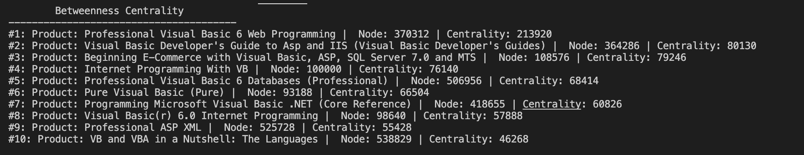
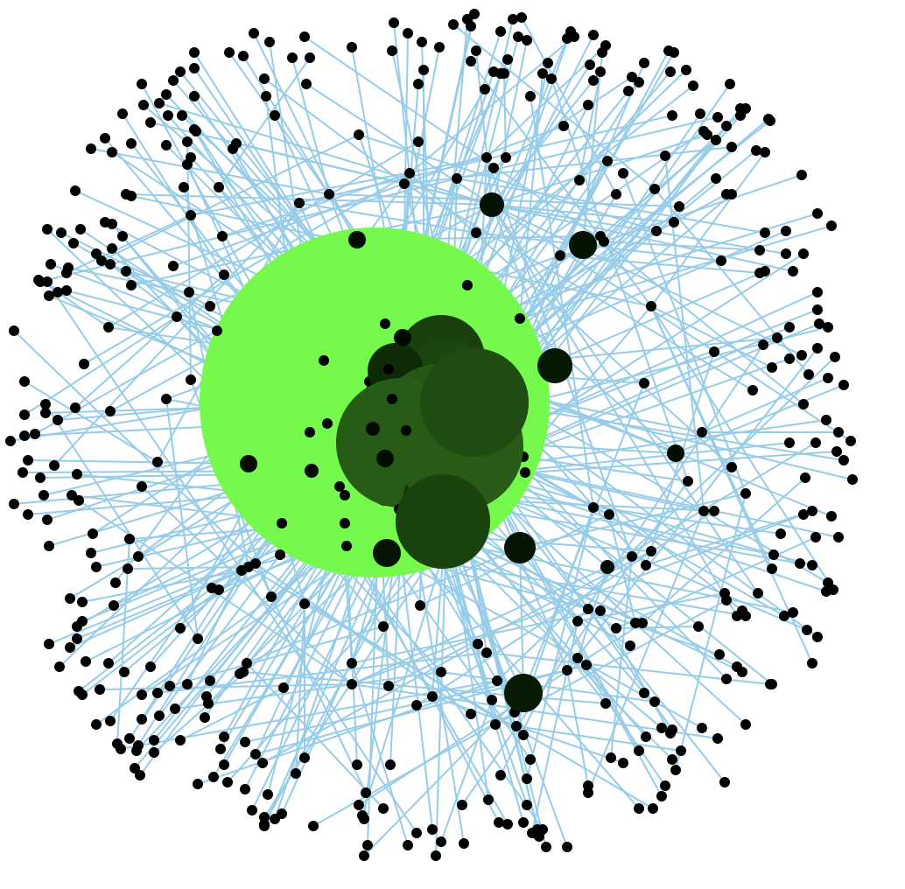

# Written Report

## BFS Traversal  

## Betweenness Centrality (Brandes Algorithm)  
This algorithm measures the centrality of a node in a graph based on the unweighted shortest path options. It is run in O(VE) time and uses O(V+E) space complexity, which is better than our anticipated O(V^2) space complexity.  
We utilized a series of test cases starting at different nodes of different sizes to ensure this algorithm worked properly. When run with the full file, this returns the top 10 list of most common product nodes, their titles, and centralities within the subgraph of the chosen starting and ending nodes. Here is an example using starting node 1 and ending node 404753:  

## Force Directed Graph Drawing (Fruchterman - Reingold Representation)  
This algorithm utilizes the inverse square law of forces to connect edges between nodes and represents it in a neat visual format. It is run in O(V^2) time and uses O(V+E) space complexity. We create an output image formatted in an SVG file.  
Highlighting our function, we have several key pieces of the algorithm broken up into helper functions that organize the functionality of our code very well. We have:  

calcu_forces- Constant based calculation of forces

In terms of the full scale project, it is run as the graph visualizer in our `main.cpp` file. To ensure this function properly worked, multiple edge test cases were run to ensure it could create the full graph with different starting nodes, sizes, and dimensions.  
The example with starting node at 100000, a size of 500, betweenness centrality of 10, dimensions 1000 x 1000, and BFS starting node/ending node of 1 and 404753 can be seen here:   
The larger green circles represent the most frequently visited product nodes, which are also listed in the Betweenness Centrality section.  

## Answer to Leading Question  
